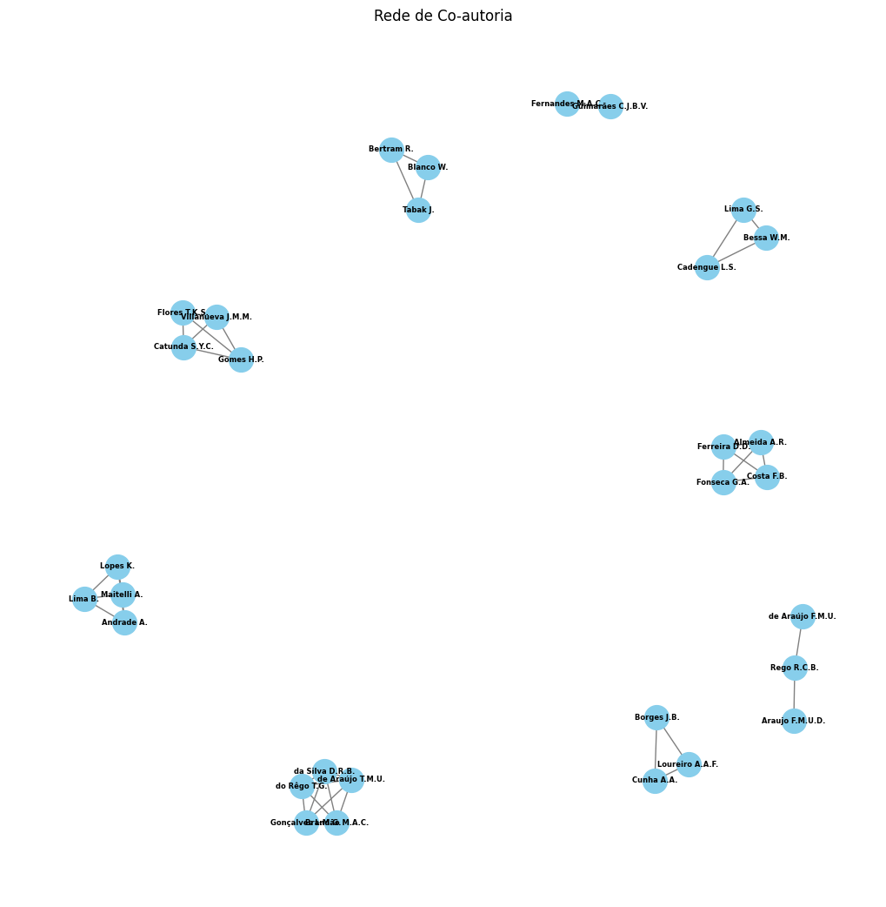
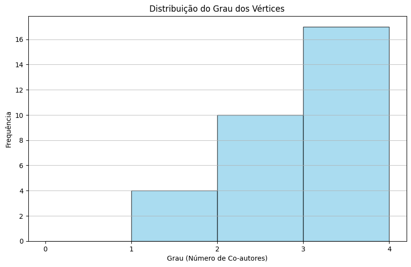

# :newspaper: Unity 1 Work 2

<i>In this present work, with the help of the NetworkX library, we created a co-authorship network from data provided by a CSV, in addition to calculating the density of the generated graph and sub-graph and generating a histogram of the degree of the graphs.</i>

## Participants:

- João Victor Soares da Silva Vieira (C&T)
- Gabriel Vítor Pereira dos Santos (C&T)

## :video_camera: Explanation in video

The video with the explanation can be located <strong>[here](https://www.loom.com/share/55c30539c9cc44bdae78bd1fa9f60abe?sid=b8ebcc54-a875-4e88-b60e-4537794f3e5c)</strong>

## :pushpin: Content

From a data csv with theme <strong>Computer Sciences</strong> downloadable at the <strong>[SCOPUS(Elsevier)](https://www.scopus.com/)</strong> Platform, we first read the data and from that, we created a co-author graph with the Python NetworkX library. With that, we discover that exists <strong>31</strong> authors and <strong>40</strong> colaborations.

So after that, we created a subgraph taking into account one variable who delimits the minimum quantity of neighbors, calculating his density.

And finally we created a histogram graph based on the degrees of the primary graph that shows the degrees (number of co-authors) and its incidence.

