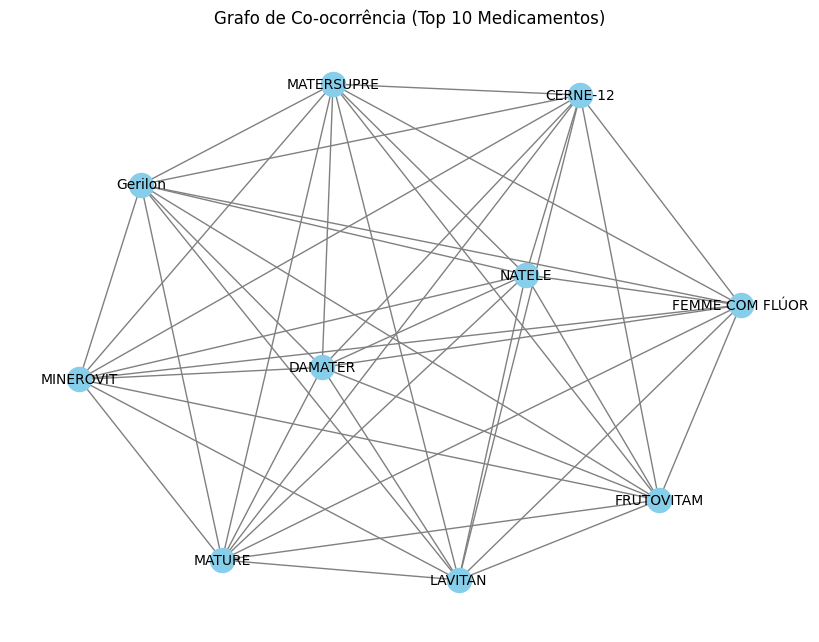
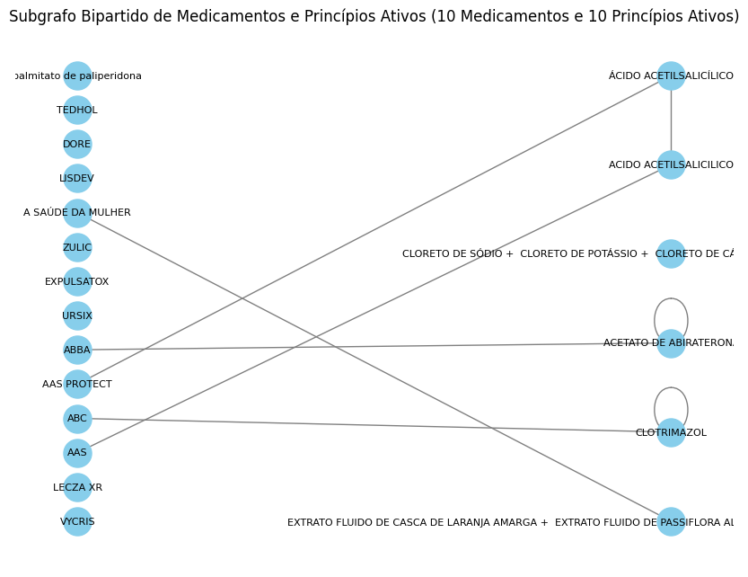
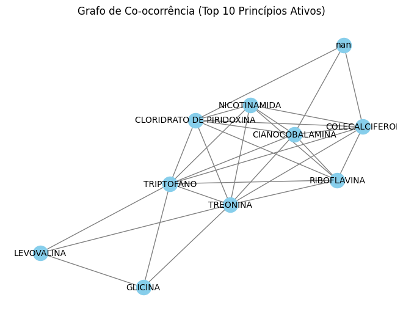

# :newspaper: Unity 1 Work 3 - Anvisa Drugs Open Data

<i>The open drug registration database is a data intelligence project that extracts information from the Datavisa system to list products that have been registered by Anvisa, including those whose registration is already valid or canceled/expired, as reported on the Agency's consultation portal.</i>

## Participants:

- Gabriel Vítor Pereira dos Santos (C&T)
- João Victor Soares da Silva Vieira (C&T)

## :video_camera: Explanation in video

The video with the explanation can be located <strong>[here](https://www.loom.com/share/08cd6f3741e84edeb47a4ecd0dc8b0b4?sid=09f2361b-b883-4df3-8764-b87d65542a14)</strong>

## :pushpin: Content

### Do drugs in the same regulatory category tend to share active ingredients?

> Network #01 Co-occurrence of Active Ingredients between Medicines
>
> ● Nodes (vertices): Each medicine is a node.
>
> ● Edges: An edge exists between two drugs if they share at least one active ingredient.
>
> ● Assortativity: Calculate assortativity based on the regulatory category of the drugs.

### Do active ingredients shared by complex drugs tend to bind to drugs with similar complexity profiles?

> Network #02 Bipartite Graph of Medicines and Active Ingredients
>
> ● Nodes (vertices): Medicines and active ingredients are distinct nodes.
>
> ● Edges: An edge connects a medicine to its respective active ingredients.
>
> ● Assortativity: Calculate the assortativity by degree within the bipartite graph to determine whether active ingredients that connect to complex medicines (with many active ingredients) tend to also connect to medicines with similar complexity profiles.

### Do drugs from the same company or therapeutic class tend to share more active ingredients?

> Network #03 Co-occurrence by Company or Therapeutic Class
>
> ● Nodes: Each medicine is a node.
>
> ● Edges: There is an edge between two medicines if they share at least one active ingredient.
>
> ● Assortativity: Calculate the assortativity based on the company or therapeutic class of the medicines.
